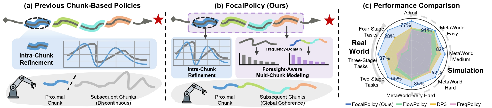
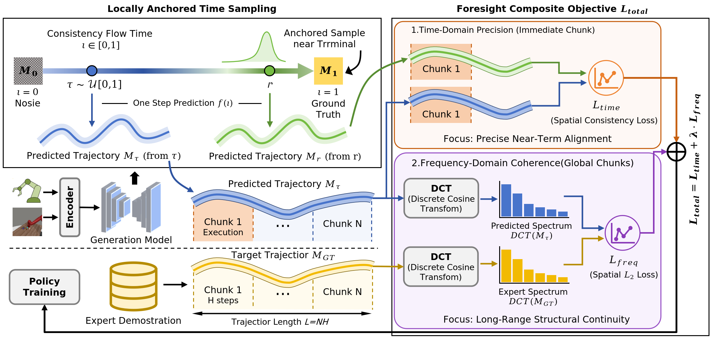

<div align="center">

## <font color="#2e6da4" style="font-size: 16px;">FocalPolicy: Foresight-Aware Visuomotor Policy with<br>Frequency-Optimized Chunking and Locally Anchored Flow Matching</font>

Qian He <sup>1,2*;</sup>,
Zhenshuo Yang <sup>1,2*;</sup>,
Wenqi Liang <sup>3</sup>,
Chunhui Hao <sup>1</sup>,
Nicu Sebe <sup>3</sup>,
[Jiandong Tian](mailto:tianjd@sia.cn) <sup>1&dagger;</sup>

<p align="center">
  <sup>1</sup> State Key Laboratory of Robotics and Intelligent Systems,
  Shenyang Institute of Automation, Chinese Academy of Sciences <br>
  <sup>2</sup> University of the Chinese Academy of Sciences <br>
  <sup>3</sup> University of Trento
</p>

<p align="center">
  <small><sup>*</sup> Equal contribution. <sup>&dagger;</sup> Corresponding author.</small>
</p>

[](https://arxiv.org/pdf/2605.15944)
[](#license)

</div>

**Abstract:** Visuomotor policies aim to learn complex manipulation tasks from
expert demonstrations. However, generating smooth and coherent trajectories
remains challenging, as it requires balancing proximal precision with distal
foresight. Existing approaches typically focus on optimizing intra-chunk action
distributions, often neglecting the inter-chunk coherence. Consequently,
inter-chunk discontinuities significantly impede the learning of coherent
long-horizon actions. To overcome this limitation and achieve a synergetic
balance between precision and foresight, we propose **FocalPolicy**, a
foresight-aware visuomotor policy that combines **F**requency-**O**ptimized
**C**hunking with **L**ocally **A**nchored flow matching. We introduce a
foresight composite objective that supervises time-domain alignment within the
proximal actions while regularizing frequency-domain structure over multiple
future action chunks to improve cross-chunk coherence. To efficiently learn
complex action distributions, we design locally anchored sampling to enhance
target signal propagation efficiency during consistency flow matching training.
Extensive experiments demonstrate that FocalPolicy outperforms existing
approaches and confirm the generalizability of our modules to other baselines.

## Pipeline

<div align="center">
  
</div>

**Motivation.** Chunk-based visuomotor policies usually improve the action
distribution inside each predicted chunk, but the boundary between adjacent
chunks is often weakly constrained. This creates inter-chunk discontinuities
that make long-horizon manipulation trajectories less smooth and less coherent.
As shown above, previous approaches focus primarily on intra-chunk refinement,
whereas **FocalPolicy** introduces a **Foresight Composite Objective (FCO)** to
jointly preserve proximal precision and distal coherence across future chunks.
This design directly targets the precision-foresight trade-off behind coherent
long-horizon action generation.

<div align="center">
  
</div>

**FocalPolicy pipeline.** FocalPolicy takes historical point-cloud observations
and robot states as inputs, encodes them as visual and proprioceptive
conditions, and predicts future action chunks through a consistency
flow-matching policy. To improve training efficiency, Locally Anchored Sampling (LAS) strengthens target signal propagation during flow matching.
The policy is optimized with Foresight Composite Objective (FCO), where the time-domain loss aligns
short-horizon proximal actions and the frequency-domain loss regularizes the
structure of multiple future chunks. Together, these objectives encourage
smooth, coherent multi-chunk trajectories without sacrificing near-term action
accuracy.

# 💻 Installation

The full environment setup is documented in [INSTALL.md](INSTALL.md). The setup was tested with Python 3.8, CUDA 11.8, MuJoCo 2.1.0, and an NVIDIA 4090 GPU.

# 📚 Data

Demonstrations are stored in `FocalPolicy/data/` as Zarr replay buffers.

```bash
bash scripts/gen_demonstration_metaworld.sh push
bash scripts/gen_demonstration_adroit.sh hammer
```

Task configs are available in `FocalPolicy/focal_policy_3d/config/task/`.

# 🚀 Training

```bash
bash scripts/train_focalpolicy.sh focalpolicy metaworld_push metaworld 0 0
```

Or run multiple tasks:

```bash
bash scripts/train_focalpolicy_multiple_tasks.sh
```

# 📈 Evaluation

Point `hydra.run.dir` to the output folder containing `checkpoints/latest.ckpt`.

```bash
cd FocalPolicy
python eval.py --config-name=focalpolicy.yaml \
  task=metaworld_push \
  root_path=/path/to/FocalPolicy/FocalPolicy \
  hydra.run.dir=/path/to/output_dir \
  training.device=cuda
```

# 📝 Citation

```bibtex
@misc{he2026focalpolicy,
  title  = {FocalPolicy: Frequency-Optimized Chunking and Locally Anchored Flow Matching for Visuomotor Policy Learning},
  author = {He, Qian and Yang, Zhenshuo and Liang, Wenqi and Hao, Chunhui and Sebe, Nicu and Tian, Jiandong},
  booktitle={Proceedings of the 43rd International Conference on Machine Learning},
  year   = {2026},
}
```

# 🙏 Acknowledgements

This repository builds on PyTorch, Hydra, MuJoCo, MetaWorld, Adroit/RRL, VRL3, PyTorch3D, DP3 and FlowPolicy.

# 📄 License

Please add a top-level license file before public release. Third-party
components retain their original licenses.
